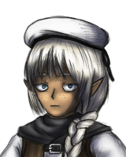
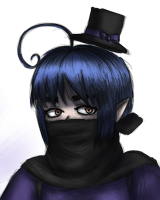

# 

#### 

---

## So... What is this even supposed to be?

**UNDEATH** is a standalone title for **GZDoom** where you take on the role of a warrior of the **Anarukon** people, tasked with the mission of slaying the demon hordes of **Hell**.

Endless, immortal... For you death is merely a temporary setback, so as you can imagine, you really can't lose... Or can you?

At the moment, there's very little to say about this, only scattered ideas exist for now, but it will all begin to take some form once focus is shifted from other projects in progress, so stay tuned.

 — Marisa

## The Story

It is the year 2165 in the human calendar. Their world has been ravaged, many of their kind have fallen since the first incursions, but others have taken a step in fighting back, repelling the demonic forces. Many fought to push them back, some earning their fame as heroes in the process. Together, they put a stop to the invasion, and **Earth** was once again saved from impending doom.

But alas, this was not enough, as corruption still lies at the very heart of **Hell** itself: The **Archdemon Generals**, the traitors who overthrew the **Kuriste Royal Family**, shattering all ties to the **Anarukon Free Communities**, they still remain in power.

Your objective, warrior, is to end the lives of each and every one of them. As a **Disciple of Veryakhai**, it is your mission to fight for the liberation of the olden realm of **Kur**, wresting it from the hands of the demons who stole it away.

## The Hit List

Your mission is to slay the nine archdemon generals responsible for the coup of 2145, each and every single one of them, without exception. Whatever they may try to get away, you must bring swift death to them. If possible, you may also attempt to locate **Akedas Aximal**, the right hand man and personal advisor of the leading general, and dispose of him too. No one knows of his actual hiding place since the onslaught of the human soldier and the heroic machine, so it may be necessary to conduct a thorough investigation. It's assumed that he is the true mastermind behind the coup, and all events since.

1. **Berias Ysharan**, the **Lustful Malefactor** A lord among impkind, he thrives in the rape and pillage of various frontier settlements to keep them *"under full submission"*. Last seen scouring the southern **Wretched Slough** for escaped slaves. The despicable bastard must pay.
2. **Destora Arathon**, the **Blood Dancer** Main strategist and trainer of the bestial armies of Hell. The fiercest of nobles serve as her devout followers, serving to bolster the main line of defense for her impregnable fortress, the so-called **Malevolent Keep**. Let her death signify retribution for the millions dead at the hands of her armies.
3. **Urthura Vexamal**, the **Beacon of Scorn** A renegade, riddled with contempt for her own kind, who has somehow managed to secure a position as general due to her sheer cruelty. Rather than the common deity of the usurpers, she appears to be a follower of the so-called **Hand of Hate**. She guards **Ethrael's Pass**, one of the main bridges connecting the southern island to the capital. She may prove to be a formidable foe.
4. **Gyeran Rashaz**, the **Flesh Servant** As the wife of **General Erebus**, she employs her privileged position to get everything she desires, whenever she desires, no matter the cost. It is implied, however, that this has caused their relationship to weaken. Holds the keys to the inner city, to be shared only with those who earn her respect. There is no forgiveness for her own crimes.
5. **Vera Akerastora**, the **Scion of Gluttony** A former noble archdemon twisted by insatiable desires. Oversees the spawning grounds southeast of the **Malevolent Keep**, where he regularly indulges in a *"cut"* of the production. Sate his hunger with the taste of death.
6. **Kaume Irishtanar**, the **Lord of Deceit** Baron of **House Irishtanar**. Addicted to seduction and deceit, he led the assassination of the rival **House Valathor** in the frontier town of **Iskar**, where he remains to ensure the exiled royal family stays under control. He must pay for the crimes against his own kind.
7. **Taeron Yraisamal**, the **Betrayer of Faith** A shameless propagandist who, despite not buying into the worship of the so-called **Tyrant** god, still chose to take part in the coup due to a seething hatred for **First Matriarch Lilith**. He has taken over the **Cathedral of Erai**, from within his lies emanate and spread out throughout the land. He must be silenced.
8. **Thaar Adarion**, the **Despot Knight** The most faithful follower of **General Erebus**, said to even envy his own wife, as he sees himself as a far worthier companion. As the self-identified *"finest warrior of Hell"*, he stands at the very gates of the **Spire of Dis**, as sworn protector of the grand general. He won't go down easily.
9. **Erebus Arthamuz**, the **Decadent Conqueror** Former celebrity turned military leader, there is little that **Erebus** has accomplished all by himself. Still, despite his reliance on others to do his dirty work, he is not to be underestimated. As descendant of the legendary **Archlord Thamuz**, he is one of the last living heirs of *"true heroic blood"*, and claims to have been chosen by the **Tyrant** as the true king of demonkind in this universe. Make him realize how wrong he is.
10. **Akedas Aximal**, the **Grand Schemer** An ancient demon, said to have personally witnessed the inception of demonkind at the hands of the **Xevetha**. Jaded by a lengthy experience of the *"downfall"* of this realm, he himself set the stage for the uprising, and oversaw every single movement up to the invasion of 2148. It appears that he's distanced himself from the generals, focused on other plans. His location is unknown, but disposing of him should be of utmost importance. There is no knowing what he may do next.

## The Characters

There's a variety of characters you can choose at the start of a new game, each with different specialties and stats. Whichever you choose from the group to play as, the others will become NPCs you can interact with throughout the game.

### Disciples of Veryakhai

Three brave warriors, bonded by their many adventures together. All trained under the great master **Nussana Veryakhai**, herself also a former apprentice of the legendary **Arkon Skhxheenzh**, hero of the **Anarukon**.

#### Sada Eryanai

Specialized in melee combat, she knows how to most efficiently employ the strongest of bladed weapons. Her skills with magic are focused on pyromancy, the field she excels at. Due to her large stature, she may have trouble moving around, but this is complemented with much heftier resistances, basically making her the tank option. She favors larger weapons, as anything too small will feel awkward to her.

**Weapons:**

 - **Pronoxyte Claymore:** A large blade of hard metal, normally wielded with both hands, but **Sada** has no trouble using it one-handed. Like pretty much all **Anarukon** melee weapons it is made of **Pronoxyte**, a strong, hard metal that is also employed in electronics due to its high conductivity and heat resistance. In contact with an open wound, it causes a numbing effect, leaving foes in the dark about the fact they've been cut down and are bleeding out, although usually, with a weapon this large, they'll be quick to notice their whole body has been cleaved in half.
 - **Nelaka Xei PDW:** A popular double-barrel submachine gun from the great imperial **Nelaka Arms Company**, employing caseless 5mm ammunition fired through a magic-based mechanism. Quite handy for dealing with targets that are too far for one to swing a blade at. With paired 2x10 round magazines, and a steady fire rate, it's enough to keep foes at bay with quick barrages. Additionally, due to its small caliber, it requires a smaller mana charge to remain operational.

**Spells:**

 - **Ember Flash:** A small burst of fire from one's open palm. Semi-short range, and more damaging the closer one is to the target.
 - **Eruption:** A staple of the *"explosion magic"* sub-school of pyromancy. Focusing on a single nearby spot, a potent blast will be triggered, sending nearby targets flying into the air, covered in flames.
 - **Red Sun:** One of the many revolutionary spells of the **Beast-Magus**. A raging inferno conjured into a self-stabilized sphere, ready to be thrown into the face of whoever is unlucky to deserve such a nasty surprise.
 - **Inferno Whirl:** A potent area denial pyromancy, summoning a conjunction of flame whirls that dance around the caster, spreading outwards in the process.

#### Zorou Sokana

Specialized in firearm combat, he's quite an expert with all sorts of guns, including some not of **Anarukon** manufacture. Certainly, he may be able to employ some rather unconventional weaponry too, if he's lucky enough to find some. His magic abilities are mostly focused on restoration and defensive spells. Out of all three he's the swiftest, but he's not very good with close combat, and will have trouble handling large weapons.

**Weapons:**

 - **Sokana Long Auto-Rifle:** One of the weapons he personally built. Useful both for heated close to mid range firefights and also for long range sniping. 6.7mm caseless, 40-round box magazine, with both semi and full auto modes. Comes with a bayonet attachment, should you be in a hurry to deal with foes getting a bit too close for comfort. The bayonet is normally retracted, but can quickly extend forwards for a deadly jab at the press of a button.
 - **2x Pronoxyte Dagger:** Two blades are better than one. Kept nicely in Zorou's garters for quick access, these deadly blades will make anyone wishing to get too close and personal regret their choice.

**Spells:**

 - **Heal:** A simple spell to close wounds and regain vitality, if only a little. Immediately stops any bleeding and regains some lost health. If you're currently looking at a companion, you will cast it on them, rather than yourself.
 - **Cure Poison:** A simple spell to purge toxins from the body. Has the unfortunate consequence of also eliminating any buffs one may get from consuming alcoholic drinks. Can also be casted on companions. Very potent toxic effects require a charged cast to fully heal.
 - **Barrier:** Generates a temporary blockade in front of you. Useful to gain some cover when there isn't any around.
 - **Grand Cross:** A potent anti-demon spell, especially effective against those with a large concentration of **Ardent Energy** in their bodies (that is, the spell becomes more effective the stronger the foe is). Archdemons, however, appear to have a natural resistance against it.
 - **Retribution:** A somewhat twisted spell that, for a limited time, returns to attackers three to nine times the amount of damage they may deal to you, depending on charge. Its usefulness tends to be very situational, as it does require the user to intentionally put themselves in harm's way.

#### Nyakko Oryusae

Specialized in magic, they are well-versed in many different schools, allowing them to perform some of the most powerful spells known. From all forms of elemental magic, to even harnessing time manipulation, nothing escapes them. They're the weakest physically, but this is compensated by a much larger mana pool. Their small frame allows for better mobility, too, but limits the kinds of conventional weapons they may be able to use. In addition, they do know some very potent spells, which they've mastered and refined over the span of decades, however, they can't be bothered to learn any new spells, so those are all they have.

**Weapons:**

 - **N/A:** Since their spells are useful enough, they don't see any usefulness in bringing weapons along. You'll have to find some in the field that strike their fancy.

**Spells:**

 - **God Slash:** A potent spell that cleaves through anything. Sharper than any blade, it can quickly dispose of large groups of enemies at a short range. Useful to clear a path when surrounded.
 - **Dark Entanglement:** Thorns of dark energy that coil around enemies, bleeding them dry.
 - **Damnation:** A potent burst of cursed energy. Leaves clouds of blackened smoke that sap life away from anything they touch.
 - **Unearthed Magic:** A pillar of blue flame springs forth and bathes everything around it in magic fire until it hits a wall.
 - **Master Flare:** A lethal blast of wild magic, comparable to a miniature star in potency.
 - **Monarch's Wrath:** A defensive *"personal space cleanser"*, releasing a geyser of scorching plasma that pushes away all nearby targets, while preventing any harm to the caster.
 - **Chronic Halt:** One of the most difficult chronomantic spells. Causes targets to be trapped in stasis for several seconds, halting all their motions. Ineffective on larger targets unless charged.

## Gameplay

As in any Souls-like (though this is more of a Souls-lite), there are three things to mainly keep track of: Your **Health**, **Stamina** and **Mana**.

- **Health** can be recovered by using various healing items and spells, as well as resting at certain safe zones. Food can also help by providing some slow regeneration. Your health drains as you take damage, and when it's all out, you die, simple as that.
- **Stamina** is recovered when idle. Simply stop moving or attacking and it'll refill on its own. There are also certain items that can make this recovery faster. Stamina is consumed by strenuous acts, such as dashing and dodging, melee attacks, firing guns, and casting certain spells. When it runs out, you'll be out of breath for a while, leaving you helpless against enemy attack.
- **Mana** can be recovered with rest, certain foods, and potions that stimulate mana absorption. It is a natural energy gathered from the environment, but there are rich sources of it that can be tapped into. Mana is consumed when casting spells, and is also necessary for operating **Anarukon** firearms, as they require a mana charge for round ignition.

Of course, there's also the matter of your weaponry, spells, ammunition, and various items you can employ. These will be detailed later.

### Death and Blood

You are **Anarukon**. To you, death is merely a temporary setback, as you can simply come back to life later on once your body has repaired itself. There are, however, certain conditions that might make this harder, or even outright impossible, and they are related to your blood.

The body of the undying requires blood to heal itself, blood brimming with iron and essential nutrients. A lack of these causes the body's healing abilities to wane, and with time, would drive the individual into a maddening thirst for blood if not treated.

You can keep yourself healthy by eating and drinking when needed, but there are also other methods by which you can enrich your blood, one of them being the valuable, but rare **Akashna Extract**: A nutritious beverage concocted with the fresh blood of a healthy **Akashna**. Do note however that the very thick stench of blood may attract unwanted attention when opened.

Thinning of the blood, if untreated, will eventually result in the inability to regenerate, meaning you will no longer be able to fight, and your body will remain dead. In this case, not all is truly lost, as your immortal soul can force the body to scatter, allowing it to reform in a safer place and giving a chance for your companions to tend to your health.

Of course, very lethal damage to your body such as, for example, being crushed to a pulp or exploding into pieces, will prevent you from regenerating, so that's also something else to watch out for.

### The Hub

Your missions will take you all around various locales within Hell, but there will always be a hub where you can take a break, have a chat with your comrades, trade goods, have lunch, enjoy a bath together, get some sleep...

While this safe haven may seem a bit small with just you and your squad around, do keep in mind that sometimes certain individuals you encounter throughout your adventures may stop by for a visit. Some might even stay and help around, set up shop, and so on. Despite the current forces in power, it's not like the civilian population rejects your kind.

So, what's this again about bathing? Well, it is an **Anarukon** tradition for warriors to enjoy a warm bath both before and after a great battle. Doing so before relieves stress and raises the spirits so you're ready for anything, and doing so afterwards is simply a good way to wash off the blood of your enemies, as well as relaxing after such arduous work.

And what about sleep? Well, you may find that over time, your performance might start to decrease. This is a sign of exhaustion, and while it can be mildly alleviated through resting, there will be a point where you actually do need to catch some Zs. Sleeping brings you back to peak performance, although the large jump in time has its consequences, as previously cleared areas will be repopulated *(but that just means you get more stuff to kill, right?)*.

### Missions

Most of your assassination jobs can be tackled in any order. In some cases, a bit of surveying ahead of time might also be helpful. Things are generally open ended as you make your way towards each target, and ultimately, to the very innermost part of **Hell**'s capital city and the *"big shot"* at the top of the list. You may sometimes find a path locked, in which case you should probably keep it marked for later, as whatever you may need for it to open could be found elsewhere.

Some side missions might also open up by request of certain people you'll come across. These offer some juicy rewards that might prove useful along the way. Nevertheless, they are optional, so you can freely choose whether or not to do them.

### The World Map

Upon leaving an area, rather than have to deal with several kilometers of travel on foot to the next one, you will be sent to the world map, where you can quickly move to other places you've unlocked. Each new exit you find from one area will open a new path to another. Make sure to explore thoroughly so you may find easy routes to all the various corners of Hell and make your journey throughout much easier.

### Companions

Spending time with your companions is always a nice thing. Not only can you hang out with them in the hub, but you can also ask them to come along with you for your missions, should you find yourself shorthanded. Having friends around also allows you to share items. Just remember one thing: They also need the stuff, don't be greedy.

While out in the field, they will fight alongside you, and try their best to catch up wherever you go. You can give them directions to stand guard / follow, target a specific foe, or even check up on their condition to see if they need healing or some specific resource. It's all about teamwork.

## Equipment

While each character has a set of starting items and weaponry, more can be found out in the field if one knows where to look, and some merchants might even sell you their wares in exchange for **Crystallized Ardent**, which can be obtained as you slay demons.

One important detail to keep in mind about this **Crystallized Ardent**, however, is that should you die and scatter yourself, any of it you're holding will be lost, as the process causes it to return to its natural state and dissipate into the air. It is not lost forever, though, as any enemies nearby might absorb it in their bodies, often raising from the dead and allowing you to recover it as you slay them again.

### Weapons

Since your bare hands aren't usually enough, weapons are of course quite important to have too. Melee weapons are the simplest to use, with primary fire being employed for quick, weaker attacks and secondary for slower, stronger swings. Firearms, on the other hand, require ammunition (and in some cases mana), which can generally be found scattered on the field or purchased from merchants. In certain cases, it's also possible to craft ammunition from raw materials (easy for **Anarukon** weaponry, as they're simple metal projectiles, but more complicated for other weapons, such as those of human manufacture). Firearms are operated with primary fire, with secondary fire having a special function depending on the weapon (e.g.: mana pool refilling on magic firearms).

There is a limit on carried weapons depending on the character, but most of the time you will start with two, assigned to slots 2 and 3. Slot 1 allows you to fall back to simple hand-to-hand melee at any moment, should you wish to.

### Spells

The very deity that created magic billions of years ago is often quoted with saying *"anyone with a soul can cast magic, but only those with a loving heart can truly **USE** it"*. Magic is as ubiquitous in the daily lives of the **Anarukon** as is technology, serving as yet another tool at their disposal to make things easier. On the field, each character has a lineup of spells they can employ, each consuming a certain amount of mana in the process. These spells are effectively *"integrated"* into them through years of learning and practice, and remain unchangeable throughout the whole game.

Spells are equipped separately from weapons, and are cast through a dedicated button. A simple tap will perform a straight cast, while holding allows you to charge up a stronger version of the spell. Each character has a set number of spell slots, balanced against their weapon slot count, with both adding up to 10.

### Items

### . . .

---